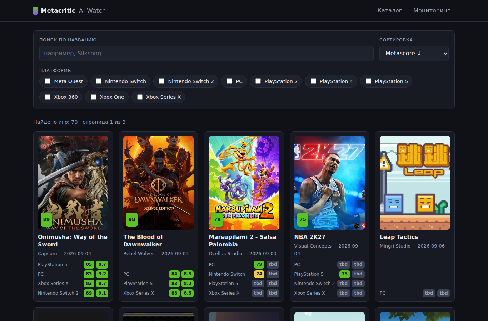
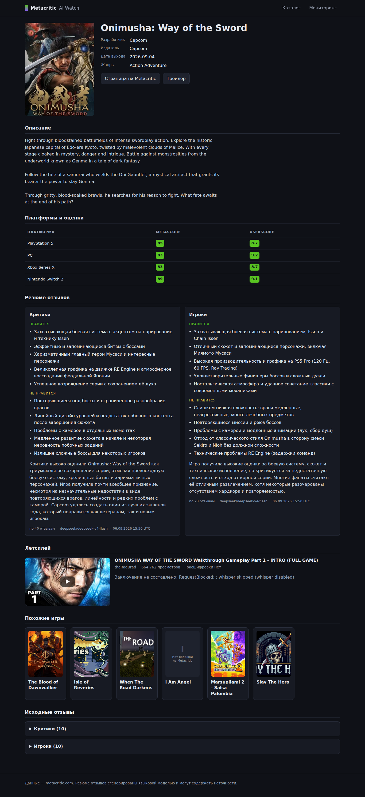
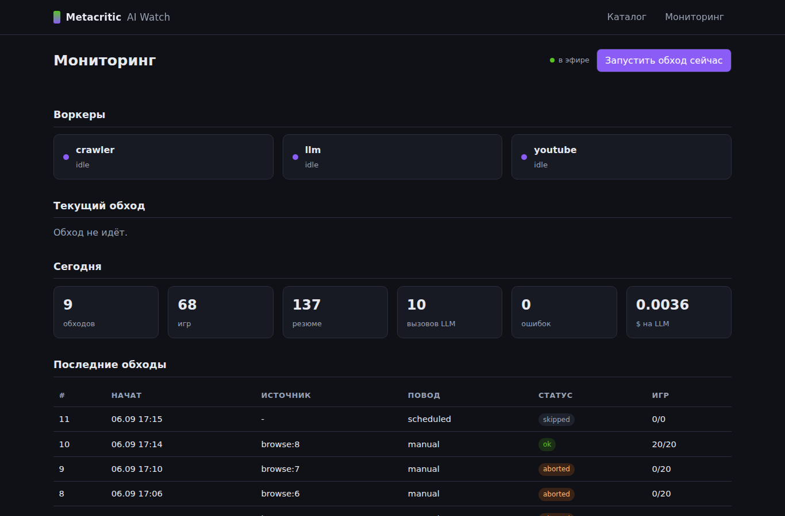

# metacritic-ai-watch

[](https://github.com/Abasov11/metacritic-ai-watch/actions/workflows/ci.yml)

Сервис-наблюдатель за новыми играми на Metacritic. Раз в час забирает 20 игр, которые
сегодня ещё не обрабатывал, сохраняет карточку игры со всеми платформами и оценками,
пересказывает отзывы критиков и игроков языковой моделью, ищет летсплей на YouTube и
показывает всё это в веб-каталоге с фильтрами и живым мониторингом.

Тестовое задание — `docs/TASK.md`, критерии приёмки и отчёт по ним — `docs/DOD.md`.

## Архитектура

```
              ┌───────────────┐
              │  APScheduler  │  раз в час (CRAWL_INTERVAL_MINUTES)
              └───────┬───────┘
                      │  run_crawl()          ← кнопка «Запустить сейчас» бьёт сюда же
              ┌───────▼───────┐
              │  app/crawler  │  глобальный замок: два обхода одновременно не идут
              └───┬───┬───┬───┘
   выбор 20 игр   │   │   │
  ┌───────────────┘   │   └───────────────┐
  │                   │                   │
┌─▼──────────────┐ ┌──▼─────────┐ ┌───────▼────────┐
│ scraper/       │ │ llm.py     │ │ youtube.py     │
│  metacritic.py │ │ OpenRouter │ │ yt-dlp +       │
│  devalue.py    │ │ deepseek → │ │ субтитры →     │
│  http.py       │ │ gemini     │ │ whisper (опц.) │
│  covers.py     │ └──┬─────────┘ └───────┬────────┘
└─┬──────────────┘    │                   │
  └───────────────┬───┴───────────────────┘
                  │  события в monitor.py (шина в памяти, 200 последних)
          ┌───────▼────────┐
          │ SQLite (WAL)   │  data/app.db + data/covers/
          └───────┬────────┘
          ┌───────▼────────┐
          │ app/main.py    │  FastAPI + Jinja2 + HTMX
          │  / /game /api  │  SSE: /monitor/stream
          └────────────────┘
```

Один процесс: планировщик, воркер и веб живут вместе. SQLite в режиме WAL, поэтому веб
читает базу, пока идёт обход.

## Как выбираются игры

По тексту задания, «сегодня» считается по дате в таймзоне `TZ` (по умолчанию
Europe/Moscow):

1. **Первый обход дня** — 20 игр из раздела New Releases на
   `https://www.metacritic.com/game/`.
2. **Каждый следующий обход в тот же день** — очередная страница «SEE ALL / Новые»
   (`/browse/game/all/all/all-time/new/?page=N`): 1, 2, 3, …
3. **Новый день** — счётчик страниц сбрасывается, снова начинаем с New Releases.

Номер страницы не хранится отдельно, а выводится из таблицы `crawl_runs`: берётся
максимальный `browse:N` за сегодня плюс один. Сброс с новым днём получается сам собой,
рассинхронизироваться нечему.

Игры с `last_crawled_at` за сегодня из списка выбрасываются; если после этого набралось
меньше 20, добираем со следующих страниц (не больше 5 подряд).

Повторный обход обновляет запись, а не дублирует: игра ищется по `slug`, платформы по
паре (игра, название), отзывы по хешу текста, резюме по паре (игра, вид).

## Резюме отзывов

Для каждой игры забираются до 40 отзывов критиков и до 40 пользовательских. Внутренний
JSON-API Metacritic отдаёт критиков по 10 штук за запрос, поэтому клиент листает по
`offset`. Дальше — два отдельных вызова модели (критики и игроки), строгий JSON
`{likes, dislikes, summary}` по-русски. Отзывы обрезаются до 700 символов каждый.

Если отзывов нет вообще, модель не вызывается — в базу пишется честная заметка
«Отзывов пока нет». Если вызов модели упал, данные скрейпинга сохраняются, но
`last_crawled_at` не проставляется — игра попадёт в следующий обход.

Каждый вызов (включая неудачные попытки) пишется в `llm_calls` с токенами, временем и
стоимостью из `usage.cost`.

## Качество резюме

Резюме должны пересказывать отзывы, а не сочинять. Это проверяется автоматически:
`python -m app.eval --report docs/EVAL_SUMMARIES.md` берёт каждый пункт `likes`/
`dislikes` из базы и спрашивает **вторую модель другого вендора**
(`openai/gpt-4.1-mini`, не участвует в написании резюме ни основной, ни резервной),
подтверждается ли утверждение хотя бы одним из тех же отзывов.

**Последний прогон: 77 из 77 утверждений подтверждены цитатой из отзывов (100%)** — по
9 резюме и 7 играм, $0.011. Отчёт с методикой, метриками и цитатами:
[`docs/EVAL_SUMMARIES.md`](docs/EVAL_SUMMARIES.md).

Стопроцентная доля сама по себе ничего не значит, если судья соглашается со всем, —
поэтому в тот же прогон подмешиваются три заведомые выдумки («кооператив на восемь
игроков», «гонки на верблюдах», «подписка за 900 рублей»). Судья отверг все три; если
бы он засчитал хоть одну, отчёт написал бы, что цифрам верить нельзя.

## Похожие игры

Гибрид тегов и текста: `score = 0.6 * jaccard(теги) + 0.4 * tfidf_cosine`.

Одного TF-IDF мало. Он читает маркетинговое описание, а у нишевых инди почти нет общих
редких слов, поэтому все косинусы жмутся к нулю и «похожие» вырождаются в случайных
соседей. Поэтому каждой игре один раз проставляются **теги из закрытого словаря**
(`app/llm.TAG_VOCABULARY`: жанры, механики, настроение, сеттинг, перспектива,
мультиплеер) — это то общее, что у двух игр вообще может совпасть. Модель обязана
выбирать только из списка, всё выдуманное отбрасывается на выходе. TF-IDF остаётся и
разводит игры, у которых теги совпали.

Кандидаты ниже порога `MIN_SCORE` не показываются вовсе: лучше честное «похожих пока не
нашлось», чем случайный сосед. У каждой похожей игры в карточке видно 2-3 общих тега —
объяснение, почему она там.

Теги считаются при первом обходе игры и не пересчитываются, пока не изменился текст, из
которого они выведены (сравнивается хэш). Для уже лежащих в базе игр —
`python -m app.crawler --backfill-tags` (90 игр, 131 вызов, $0.023).

Что это дало на реальной базе — до и после разметки, порог 0.12:

| Игра | Было | Стало |
|---|---|---|
| Onimusha: Way of the Sword | 0.033 The Blood of Dawnwalker — ничего не проходило порог | **0.306** The Blood of Dawnwalker · общее: action, combat, exploration |
| The Blood of Dawnwalker | 0.034 Carriers Together (случайный сосед) | **0.306** Onimusha: Way of the Sword · общее: action, combat, exploration |
| Kitty Needs A Home! | 0.035 100 Panda Cats | **0.223** 100 Panda Cats · общее: puzzle, puzzle-solving, cute |

## Летсплеи

`yt-dlp` ищет `ytsearch15:<название> let's play`, отбрасывает трейлеры, обзоры, ролики
короче 3 минут и видео про другие игры, из оставшихся берёт самое просматриваемое.
Речь блогера — из субтитров (`youtube-transcript-api`, авто-субтитры годятся); если их
нет, опционально `faster-whisper` по первым 15 минутам аудио. По тексту — заключение
модели `{verdict, highlights}`.

Отбор строгий, потому что коротким названиям легко найти двойника. Ролик считается
летсплеем, только если выполнены оба условия:

1. **Игра действительно названа.** Порог зависит от длины названия:
   - **1-2 значимых слова** («Flip Off», «Tilefall») — нужна точная фраза целиком, и в
     заголовке, и в описании: такие названия часто просто английские выражения.
   - **3 слова** («Next Reign Kingdom») — должны найтись все три, в любом порядке.
     При пороге 60% сюда попадал каждый второй чужой ролик.
   - **4 и больше** — хватает 60% слов, это переживает подзаголовки и номера серий.
2. **Ролик заявляет себя прохождением** — в заголовке, описании или тегах есть
   `let's play`, `gameplay`, `walkthrough`, `playthrough`, `first look`, `part N`,
   `прохождение`, `летсплей`, `геймплей` и подобное.

Ссылка на Steam/itch/консольный магазин в описании — плюс при выборе среди уже
прошедших фильтр кандидатов, а не пропуск мимо проверок. Если ничего не подошло,
записывается «подходящий летсплей не найден»: чужой ролик хуже, чем его отсутствие.

**Важно:** YouTube отдаёт субтитры только полноценному извлечению видео, а его с
датацентровых IP отклоняет («Sign in to confirm you're not a bot»). Чтобы заработало,
должны сойтись **три вещи одновременно** — без любой из них возвращается тот же отказ:

1. **Куки** залогиненного аккаунта — `YOUTUBE_COOKIES_FILE`.
2. **JS-рантайм и решатель челленджей** — `YOUTUBE_JS_RUNTIME=node` (нужен установленный
   node) и `YOUTUBE_REMOTE_COMPONENTS=ejs:github`, по которому yt-dlp сам скачивает
   решатель и кладёт в кэш.
3. **PO-токен** — плагин `bgutil-ytdlp-pot-provider` (ставится с зависимостями) плюс
   собранный node-скрипт, путь к нему в `YOUTUBE_POT_SCRIPT`. **Без пути плагин молча
   неактивен** и всё выглядит так, будто дело в куках.

`youtube-transcript-api` для этого не годится совсем — он игнорирует куки и всегда
получает `RequestBlocked`; из зависимостей убран.

Кэш yt-dlp лежит в `DATA_DIR/yt-dlp-cache`, а не в `~/.cache`: юнит systemd работает с
`ProtectHome=read-only`, и запись в домашний каталог провалилась бы.

Если чего-то из трёх нет, стадия не падает: **карточка честно показывает найденный ролик
со ссылкой, каналом и просмотрами, а вместо заключения — причину, по которой нет
расшифровки.**

### Настройка расшифровки

```bash
# 1. node (нужен для решателя JS-челленджей)
node --version          # v22 подойдёт

# 2. скрипт PO-токенов
git clone https://github.com/Brainicism/bgutil-ytdlp-pot-provider /srv/skytec/bgutil
cd /srv/skytec/bgutil/server && npm ci && npx tsc
ls build/generate_once.js        # этот путь и пойдёт в YOUTUBE_POT_SCRIPT

# 3. куки (см. ниже), затем в .env:
#    YOUTUBE_COOKIES_FILE=/srv/skytec/metacritic-ai-watch/data/youtube-cookies.txt
#    YOUTUBE_POT_SCRIPT=/srv/skytec/bgutil/server/build/generate_once.js
```

Проверить связку целиком можно так же, как это делает сервис:

```bash
.venv/bin/python -c "from app.youtube import fetch_subtitles; print(len(fetch_subtitles('VIDEO_ID')))"
```

### Как получить `youtube-cookies.txt`

1. Заведите **отдельный** аккаунт YouTube — файл даёт доступ к сессии, и его не стоит
   делать из основного.
2. Поставьте расширение **«Get cookies.txt LOCALLY»**
   ([Chrome](https://chromewebstore.google.com/detail/get-cookiestxt-locally/cclelndahbckbenkjhflpdbgdldlbecc),
   есть и для Firefox). Именно LOCALLY: оно не отправляет куки на сторонние серверы.
3. Залогиньтесь на youtube.com этим аккаунтом, откройте расширение и экспортируйте куки
   в формате **Netscape** (`youtube-cookies.txt`).
4. Положите файл рядом с базой (`data/` в `.gitignore`, в репозиторий он не попадёт) и
   пропишите путь в `YOUTUBE_COOKIES_FILE`.
5. **Не открывайте youtube.com этим же аккаунтом после экспорта.** Google ротирует
   сессию, и выгруженные куки перестают приниматься: в логах появляется
   `playability status: LOGIN_REQUIRED` и тот же «Sign in to confirm you're not a bot»,
   хотя по датам куки ещё живые. Лечится повторным экспортом.

Повторить расшифровку для роликов, которые нашлись, но не прочитались:
`python -m app.crawler --refresh-letsplays`.

## Веб-интерфейс

- `GET /` — список игр: обложка, лучший Metascore крупно, бейджи платформ с обеими
  оценками. Живой поиск, мультифильтр по платформам, сортировка, пагинация по 24.
  Состояние целиком в query-string — ссылку можно переслать. HTMX обновляет только
  результаты; без JS форма работает обычным GET.
- `GET /game/{slug}` — полная карточка: описание, таблица платформ, два блока резюме,
  летсплей, похожие игры, исходные отзывы по 10 каждого вида.
- `GET /monitor` — состояние воркеров, прогресс текущего обхода, счётчики за сегодня,
  последние обходы, живой лог. Обновление через SSE (`/monitor/stream`), переподключение
  штатное для `EventSource`. Кнопка «Запустить обход сейчас» → `POST /monitor/run`
  (202, либо 409 если обход уже идёт).
- Кнопка «Обновить» в карточке — `POST /game/{slug}/refresh`: перекачивает эту игру
  (карточка, отзывы, резюме, теги, летсплей) в фоне. Защита та же, что у ручного
  обхода: проверка источника и не чаще раза в минуту на игру. Пока идёт обновление,
  полоска состояния опрашивается HTMX раз в 3 секунды, по готовности страница
  перезагружается; в мониторинге это видно отдельным событием.
- `GET /api/games`, `GET /api/games/{slug}`, `GET /healthz` — JSON.
- Обложки скачиваются в `data/covers/` и отдаются с `/covers/<slug>.<ext>`: Metacritic
  отвечает 403 на подписанные ссылки, если их запросить повторно. У части игр обложки
  нет и на самом Metacritic (13 из 70 на момент проверки) — в payload карточки пустой
  список `images`, ни `og:image`, ни JSON-LD `image`. Для таких показывается явная
  заглушка «Нет обложки на Metacritic», а не битая картинка.

## Как это выглядит

Скриншоты живого сервиса.

**Список игр** — обложка, лучший Metascore крупно, бейджи платформ с обеими оценками;
сверху живой поиск, мультифильтр по платформам и сортировка.



**Карточка игры** — описание, таблица платформ, два блока резюме («Критики» и
«Игроки»), летсплей, похожие игры и исходные отзывы.



**Мониторинг** — состояние воркеров, прогресс текущего обхода, счётчики за сегодня,
последние обходы и живой лог событий по SSE.



Мобильная вёрстка (375 px): [docs/screenshots/mobile.png](docs/screenshots/mobile.png).

## Выбор модели

Основная — `deepseek/deepseek-v4-flash`, резервная — `google/gemini-2.5-flash-lite`
(2 попытки на основной, потом резерв). Сравнение семи моделей на одном промпте с ценами
и временем: [`docs/MODEL_CHOICE.md`](docs/MODEL_CHOICE.md).

Порядок стоимости: около $0.0004 за резюме, то есть ~$0.02 за обход из 20 игр.

## Запуск локально

Нужен Python 3.12 и ключ OpenRouter.

```bash
cp .env.example .env && $EDITOR .env    # вписать OPENROUTER_API_KEY
make dev                                # поднимет .venv и запустит на 127.0.0.1:8010
```

То же самое без make:

```bash
python3 -m venv .venv && .venv/bin/pip install -e ".[dev]"
cp .env.example .env
.venv/bin/uvicorn app.main:app --host 127.0.0.1 --port 8010
```

Схема базы создаётся при старте, миграции не нужны. Первый обход планировщик запустит
через минуту после старта; принудительно — кнопкой на `/monitor` или
`make crawl-once LIMIT=3`.

Команды `make`: `dev`, `test`, `lint`, `format`, `crawl-once`, `refresh-covers`,
`docker-up`, `docker-down`.

## Переменные окружения

Все читаются из `.env` (он в `.gitignore`), пример — `.env.example`.

| Переменная | По умолчанию | Что делает |
|---|---|---|
| `OPENROUTER_API_KEY` | — | **Обязательна.** Без неё резюме не генерируются, остальное работает |
| `OPENROUTER_MODEL` | `deepseek/deepseek-v4-flash` | Основная модель |
| `OPENROUTER_FALLBACK_MODEL` | `google/gemini-2.5-flash-lite` | Резерв при ошибке основной |
| `LLM_TIMEOUT` | `60` | Таймаут вызова модели, с |
| `TZ` | `Europe/Moscow` | Таймзона, по которой считается «сегодня» |
| `SCHEDULER_ENABLED` | `1` | Часовой планировщик. `0` — веб работает, обходы только вручную (так собирается CI) |
| `CRAWL_INTERVAL_MINUTES` | `60` | Период обхода |
| `CRAWL_BATCH_SIZE` | `20` | Игр за обход |
| `REVIEWS_PER_KIND` | `40` | Отзывов каждого вида на игру |
| `DATA_DIR` | `<репозиторий>/data` | Где лежат `app.db` и `covers/` |
| `DATABASE_URL` | `sqlite:///<DATA_DIR>/app.db` | Строка подключения |
| `REQUEST_DELAY` | `1.0` | Минимальная пауза между запросами к Metacritic, с |
| `REQUEST_TIMEOUT` / `REQUEST_RETRIES` | `20` / `3` | Таймаут и число попыток |
| `YOUTUBE_ENABLED` | `1` | Стадия летсплеев |
| `YOUTUBE_COOKIES_FILE` | — | Netscape-cookie для YouTube; без него субтитры недоступны с серверного IP |
| `YOUTUBE_TIMEOUT` | `120` | Бюджет стадии на одну игру, с |
| `YOUTUBE_MAX_AGE_DAYS` | `7` | Насколько долго летсплей считается свежим |
| `YOUTUBE_WHISPER_ENABLED` | `0` | Локальное распознавание речи (нужен extra `whisper` и ffmpeg) |
| `SITE_URL` / `SITE_TITLE` | — | Заголовки `HTTP-Referer` и `X-Title` для OpenRouter |

## Тесты

```bash
make test     # или .venv/bin/pytest -q
make lint     # ruff check + ruff format --check
```

238 тестов, в сеть не ходят: HTTP мокается через `httpx.MockTransport`, парсеры
работают на сохранённых страницах Metacritic в `tests/fixtures/`, вызовы модели и
YouTube заглушены.

На каждый push и pull request в `main` GitHub Actions прогоняет
[тот же набор](.github/workflows/ci.yml): `ruff check`, `ruff format --check`,
`pytest -q`, `pip-audit`, плюс отдельным job собирает образ, поднимает контейнер и
ждёт `200` от `/healthz`. Секреты не нужны ни одному из job.

## Деплой

Сервис слушает только `127.0.0.1:8010`, TLS и публичный порт — на nginx.

### Docker

```bash
cp .env.example .env && $EDITOR .env
mkdir -p data && sudo chown -R 1000:1000 data   # uid пользователя в образе
docker compose up -d --build
curl -s localhost:8010/healthz
```

`data/` смонтирован как volume — база и обложки переживают пересборку.

В образе **нет node и скрипта PO-токенов**: стадия расшифровки летсплеев там работает в
режиме «ролик найден, расшифровки нет». Чтобы включить её в контейнере, смонтируйте куки
и собранный `generate_once.js` внутрь и укажите пути переменными, а в образ добавьте
node — либо оставьте эту стадию для запуска под systemd, как сейчас на проде.
`restart: unless-stopped` поднимает контейнер после перезагрузки.

Образ проверен сборкой и запуском через **rootless podman** (Docker-демона на сервере
нет): 245 МБ, `/healthz` отвечает, база создаётся в томе. `podman` понимает и
`Dockerfile`, и `docker-compose.yml` — команды те же, с заменой `docker` на `podman`.

### systemd (без Docker)

```bash
python3 -m venv .venv && .venv/bin/pip install -e .
sudo cp deploy/metacritic-ai-watch.service /etc/systemd/system/
sudo systemctl daemon-reload
sudo systemctl enable --now metacritic-ai-watch
systemctl status metacritic-ai-watch
journalctl -u metacritic-ai-watch -f
```

В юните проверьте `User`, `WorkingDirectory` и `EnvironmentFile` — они прописаны под
`/srv/skytec/metacritic-ai-watch` и пользователя `ubuntu`. `MemoryMax=1G` рассчитан на
конфигурацию без Whisper.

### nginx

`deploy/nginx.conf` — server-блок под домен; замените `${DOMAIN}`. Отдельная локация
для `/monitor/stream` с `proxy_buffering off` и `proxy_read_timeout 3600s`, иначе SSE
не работает. Сертификат — `certbot --nginx -d <домен>`.

## Безопасность

Сервис анонимный: авторизации нет ни у одной ручки, каталог и мониторинг публичны.
Поэтому здесь нет ни сессий, ни кук, ни персональных данных — модель угроз сводится к
«не дать анониму навредить сервису или его посетителям».

Что сделано:

| Мера | Где |
|---|---|
| Заголовки: `Content-Security-Policy`, `X-Frame-Options: DENY`, `X-Content-Type-Options: nosniff`, `Referrer-Policy: no-referrer` | middleware в `app/main.py` |
| CSP без `unsafe-inline`: скрипт мониторинга вынесен в `/static/monitor.js`, htmx отключает инжект стилей через `<meta name="htmx-config">` | `app/templates/base.html`, `app/static/monitor.js` |
| `POST /monitor/run`: проверка `Sec-Fetch-Site`/`Origin` (кросс-сайт → 403) и не чаще одного запуска в минуту (→ 429) | `app/main.py` |
| Внешние ссылки только `http(s)`; `javascript:`, `data:` и протокол-относительные `//host` отбрасываются | `safe_url()` + шаблоны |
| SQL только через параметры SQLAlchemy; `sort` — по белому списку, `platform` — параметризованный `IN` | `query_games()` |
| Экранирование HTML — автоэкранирование Jinja, нигде нет `\|safe`; в JS мониторинга пользовательский текст идёт через `textContent` | шаблоны, `monitor.js` |
| `/covers/<name>`: имя обязано матчить `^[a-z0-9][a-z0-9-]{0,199}\.(jpg\|png\|webp\|gif\|avif)$`, иначе 404 | `covers.path_for()` |
| Обложки: только распознанные по сигнатуре форматы, лимит 5 МБ, запись через временный файл | `app/covers.py` |
| Слаг проверяется при разборе — он становится и путём URL, и именем файла | `_VALID_SLUG_RE` |
| Ограничения на вход: `q` до 100 символов, до 40 платформ в фильтре, `page` в пределах | `app/main.py` |
| Секреты в ключах query вычищаются из текста ошибок перед логом и монитором | `scraper/http.scrub()` |
| `yt-dlp` только через Python API, без `subprocess` и `shell=True`; embed собирается из 11-символьного id, а не из внешнего URL | `app/youtube.py`, `youtube_embed()` |
| Проверка зависимостей на известные уязвимости | `make audit` (`pip-audit`) |

Сознательно **не** сделано:

- **Нет аутентификации на `/monitor`.** Это витрина тестового задания, кнопка запуска
  должна быть видна проверяющему. Проверка источника и лимит частоты защищают от
  случайного и браузерного злоупотребления, но любой, кто дойдёт до публичного адреса,
  может запустить обход. Если сервис станет не демонстрационным — `auth_basic` на
  `/monitor*` в nginx (одна строка) или токен в заголовке.
- **Нет rate-limit на чтение.** Каталог отдаётся из SQLite, дорогих запросов нет.
- **Публичный ключ Metacritic зашит дефолтом** — сайт отдаёт его в HTML каждому
  посетителю, это не секрет.
- **Резюме строятся по чужому тексту.** Отзывы с Metacritic и расшифровки с YouTube
  попадают в промпт как есть. Модель без инструментов и без доступа к данным, ответ
  приводится к строкам и экранируется при выводе, а исходный отзыв и так печатается на
  той же странице — то есть подставить в резюме свой текст злоумышленник может, а выйти
  за пределы текста нет.

## Ограничения

- **Один процесс.** Замок обхода, шина событий мониторинга и кеш похожих игр живут в
  памяти. `uvicorn --workers N` сломает и мониторинг, и защиту от параллельных обходов.
- **Субтитры YouTube недоступны с серверного IP** без cookie-файла — см. выше.
- **Whisper выключен.** Даже если бы аудио скачивалось, `small` int8 на 4 CPU — это
  3-6 минут на ролик, что не влезает в часовой интервал при 20 играх.
- **Userscore по платформам стоит по запросу на платформу.** Metacritic не отдаёт их
  на карточке игры, поэтому у игры с 7 платформами обход делает 7 дополнительных
  запросов.
- **Публичный ключ Metacritic** (`METACRITIC_API_KEY`) зашит дефолтом в `app/config.py`.
  Это не секрет — сайт отдаёт его в HTML каждому посетителю, — но при желании
  переопределяется через окружение.
- **Похожие игры слабы на маленькой базе** (см. выше).

## Что дальше

- Вынести воркер в отдельный процесс, а замок и шину событий — в базу или Redis, чтобы
  веб можно было масштабировать.
- Инкрементально обновлять отзывы по дате, а не забирать 40 штук каждый раз.
- Прогреть базу до нескольких сотен игр — тогда TF-IDF начнёт давать осмысленные
  рекомендации; при большем объёме заменить на эмбеддинги.
- Ретраить игры со статусом `partial` приоритетно, а не в общей очереди.
- Alembic вместо самодельного `ALTER TABLE ADD COLUMN` в `init_db`.
